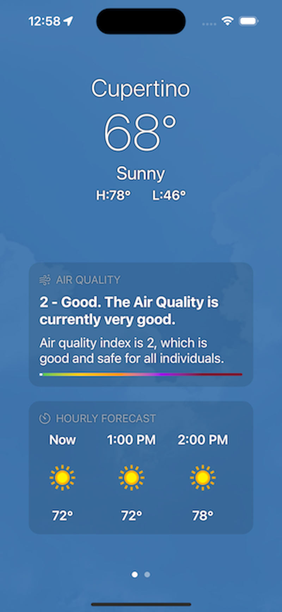
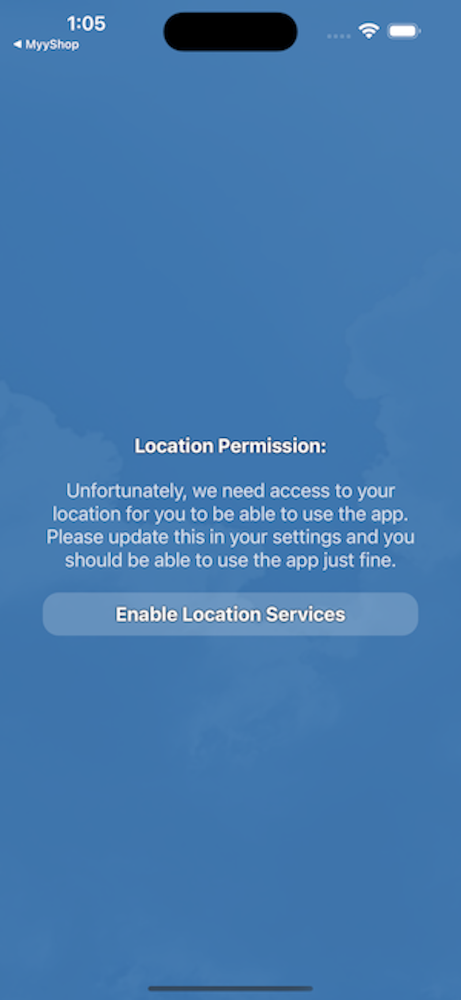

# iOS Weather App

The iOS Weather App is a demonstration project showcasing my implementation approach for developing iOS applications with backend components and privacy considerations. This project is inspired by Apple's [Weather App](https://apps.apple.com/us/app/weather/id1069513131) and is implemented using `SwiftUI`, although similar results can be achieved using `UIKit`.

## Features

### Location Permissions
The application requires location permissions to function properly. On the initial launch, the user is prompted to grant permission for accessing their location.

### Current Location Weather
The app provides real-time weather conditions for the user's current location. It displays an hour-by-hour forecast, starting from the current time and extending until the end of the day. This functionality is powered by the weatherapi.com API.

### Location History
Similar to Apple's Weather App, this application keeps track of the user's location history. It allows users to view current weather conditions for previously visited locations, organized by city.

## Design Pattern

The iOS Weather App follows the Model-View-ViewModel (MVVM) design pattern, which I consider the most suitable approach. While some might argue that this pattern might be slightly excessive for a small application, I found it to be highly beneficial, significantly reducing development time, and seamlessly integrating with SwiftUI.

## Dependencies

This application prioritizes simplicity and, therefore, does not rely on any third-party libraries or frameworks. All functionality has been implemented natively in Swift/SwiftUI.

## Screenshots

  

    
  

  

    
  

  

    
  

  

    
  

  

    
  

    
    
    
    
    

**Note:** This application is intended for demonstration purposes only. It is not production-ready and should not be used in a live production environment.

