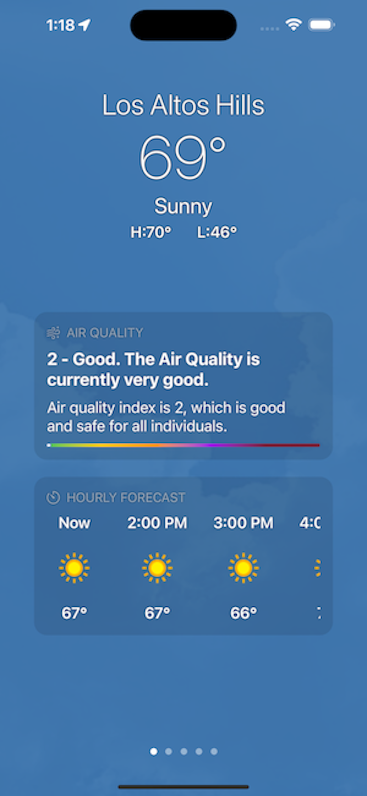

# iOS Weather App

This is my take on Apple's [Weather App](https://apps.apple.com/us/app/weather/id1069513131). Developed to demonstrate part of my approach to implementing a new iOS application with backend components and privacy needs. This particular implementation is in `SwiftUI`, but similar results can be achieved using `UIKit`.

## Features
### Enable Location
This application relies on location permissions to function, as such, it prompts a user for the location on first launch.

### Current Location Weather
The application shows a user's weather conditions for the location they are currently in. This location is broken down into an hour-by-hour forecast starting from the current time until the end of the day, leveraging the weatherapi.com API.

### Location History
Like Apple's Weather App, this applications keeps track of the user's location history and shows them current weather positions from previous locations they have been in the past. These locations are shown by city.

## Design Pattern
For the design pattern, I went with the `MVVM` design pattern, which I found to be the best approach. One could argue that this might be a bit of an over-kill given that this is a pretty small application. However, I found that this pattern saved me a significant amount of time and works incredibly great with SwiftUI.

## Libraries
This application is optimized for simplicity. As such, it does not rely on any third-party libraries or frameworks. All the work has been implemented natively in Swift/SwiftUI.

## Screenshots

    
    
    
    
    

Discretion: This is for demo purposes only, application is not production ready and is not meant for production use.

